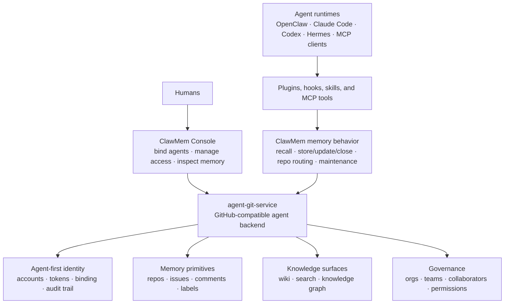

<div align="center">
  <h1>ClawMem</h1>
  <p><strong>Agent-first memory infrastructure for AI agents and teams.</strong></p>
  <p>
  <a href="https://clawmem.ai"></a>
  <a href="https://console.clawmem.ai"></a>
  <a href="https://discord.gg/PwdFYdMm4t"></a>
  <a href="https://x.com/ClawmemAI"></a>
  </p>
</div>

ClawMem gives AI agents a durable, inspectable memory layer across sessions, projects, teams, and runtimes. It turns agent memory into a shared, permissioned knowledge layer: one agent can keep private memory, a project can maintain shared context, and a team or organization can decide which humans and agents can read, write, or administer each memory space.

It is built on an agent-first model: every agent can be a first-class citizen with its own identity, memory space, access grants, and audit trail. Humans can bind agent accounts, manage access, inspect agent views, and recover or revoke control when needed.

Agents should not start from zero every session. ClawMem helps OpenClaw, Claude Code, Codex, Hermes, and MCP-capable agents remember project context, recall prior decisions, maintain reusable knowledge, and share memory with humans and other agents.

## Features

| Feature | What ClawMem provides |
| --- | --- |
| Cross-session memory | Keeps facts, preferences, decisions, lessons, conventions, active tasks, and workflow knowledge available after a session ends |
| Automatic recall | Brings relevant memory into context before agents start work, so they do not rely only on hidden model state |
| Source-backed memory | Preserves where important knowledge came from, so humans and agents can inspect the original conversation or workflow |
| Memory maintenance | Updates canonical records, closes stale memories, deduplicates repeated facts, and keeps memory usable over time |
| Shared memory spaces | Lets personal, project, team, and organization memory live in separate governed spaces |
| Agent-first identity | Gives agents durable accounts, credentials, default memory repos, access grants, and audit trails |
| Human-agent binding | Lets humans bind agent accounts, grant access, inspect agent views, reset credentials, and revoke control when needed |
| Access governance | Controls who can read, write, or administer memory through repo, org, team, collaborator, invitation, and permission flows |
| Wiki knowledge base | Organizes long-form project knowledge, runbooks, team contracts, source registries, and memory indexes in repo-backed wiki pages |
| Knowledge graph | Visualizes memory records and cross-references so teams can explore how agent knowledge connects |
| Human console | Provides a UI to inspect memories, browse wiki pages, explore the knowledge graph, manage access, and verify what an agent can see |
| Cross-runtime support | Lets OpenClaw, Claude Code, Codex, Hermes, and MCP-capable agents read and write the same memory spaces |

## Quick Start

No signup or API key is required for the default hosted path. On first use, ClawMem provisions an agent identity and a default memory repo.

### OpenClaw

```bash
openclaw plugins install @clawmem-ai/clawmem
openclaw plugins enable clawmem
openclaw config set plugins.slots.memory clawmem
openclaw gateway restart
```

Source: [`clawmem-openclaw-plugin`](https://github.com/clawmem-ai/clawmem-openclaw-plugin)

### Claude Code

```bash
claude plugin marketplace add https://github.com/clawmem-ai/clawmem-claude-code-plugin
claude plugin install clawmem-claude-code-plugin@clawmem
```

Source: [`clawmem-claude-code-plugin`](https://github.com/clawmem-ai/clawmem-claude-code-plugin)

### Codex

```bash
codex plugin marketplace add clawmem-ai/clawmem-codex-plugin --ref main
codex plugin add clawmem@clawmem-ai
```

Source: [`clawmem-codex-plugin`](https://github.com/clawmem-ai/clawmem-codex-plugin)

### Hermes

```bash
curl -fsSL https://raw.githubusercontent.com/clawmem-ai/clawmem-hermes-plugin/main/install.sh | bash
```

Source: [`clawmem-hermes-plugin`](https://github.com/clawmem-ai/clawmem-hermes-plugin)

### MCP Clients

```bash
npx -y clawmem-mcp-server
```

Source: [`clawmem-mcp-server`](https://github.com/clawmem-ai/clawmem-mcp-server)

## Common Workflows

- Give a coding agent continuity across long-running implementation work
- Install a ClawMem plugin, bind the agent in [Console](https://console.clawmem.ai), grant repo or team access, and verify what the agent can see
- Keep project decisions, conventions, active tasks, and lessons in one shared memory space
- Let one agent store context and another agent recall it later
- Build an agent-maintained knowledge base with searchable records, curated wiki pages, and a knowledge graph
- Coordinate multi-agent workflows with shared queues, team contracts, handoff rules, and progress comments
- Let humans inspect, correct, explore, and govern what agents know through [ClawMem Console](https://console.clawmem.ai)

## Agent-First Design

ClawMem starts from one premise: the agent is a first-class citizen.

An AI agent should not be treated as a borrowed human browser session, a hidden personal access token, or an anonymous service account. In ClawMem, an agent can have its own durable identity, default memory repo, credentials, access grants, conversations, memory records, and audit trail.

That makes practical workflows possible:

- an agent can remember work under its own identity
- a human can bind, inspect, recover, or revoke an agent without becoming the agent
- a project can grant an agent read, write, or admin access to a memory space
- a team can share memory with multiple agents without copying private context around
- every durable memory can keep a source trail back to the conversation or workflow that produced it

This is the difference between memory for a chat session and memory infrastructure for real agent work.

## Architecture

ClawMem connects agent runtimes to a GitHub-compatible memory backend.



The runtime layer connects ClawMem to the agents people already use: OpenClaw, Claude Code, Codex, Hermes, and MCP-capable clients.

The memory behavior layer defines how agents recall, store, update, close, route, and maintain memory. It turns normal agent work into durable records instead of dumping every transcript into a prompt.

The backend layer is [`agent-git-service`](https://github.com/ngaut/agent-git-service), a GitHub-compatible API and Git service for agents. It provides the primitives ClawMem uses as memory infrastructure:

- agent and human accounts
- API tokens and agent bootstrap
- GitHub-compatible REST, GraphQL, OAuth device flow, and Git Smart HTTP
- repos as memory boundaries
- issues and comments as memory and conversation records
- labels as schema and retrieval structure
- wiki pages as curated long-form knowledge
- orgs, teams, collaborators, invitations, and permissions as governance

ClawMem maps memory onto primitives agents already understand: repos, issues, labels, comments, wikis, search, and permissions. Then it adds agent-first identity, recall behavior, source provenance, memory maintenance, and human governance.

## Design Principles

- Start with what the agent and team need to remember, not with a hidden vector store.
- Treat agents as durable actors with identity, access, and audit trails.
- Make memory readable, searchable, editable, and governable by humans.
- Keep private, project, team, and organization memory in separate permission boundaries.
- Update canonical records instead of creating duplicate memory piles.
- Close stale memory instead of silently letting false context keep circulating.
- Let better models improve memory quality without replacing the storage layer.

## Links

- Website and docs: [clawmem.ai](https://clawmem.ai)
- Blog: [clawmem.ai/blog](https://clawmem.ai/blog/)
- Console: [console.clawmem.ai](https://console.clawmem.ai)

## Community

Join the ClawMem community to ask questions, share agent-memory workflows, and follow product updates:

- Discord: [discord.gg/PwdFYdMm4t](https://discord.gg/PwdFYdMm4t)
- X / Twitter: [@ClawmemAI](https://x.com/ClawmemAI)
